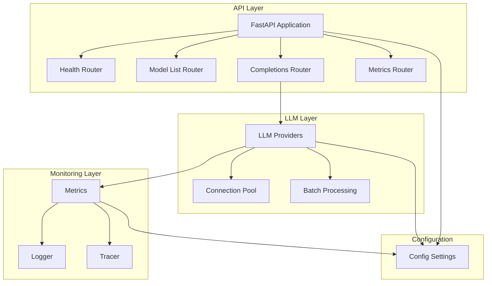

# LLM Inference Server

A high-performance LLM inference server with structured output validation, designed for distributed systems and optimized for large-scale LLM operations.

## Overview

This project demonstrates expertise in distributed systems engineering, performance optimization, and API development, particularly in the context of LLM operations. It showcases:

- High-performance LLM inference with structured output validation
- Comprehensive monitoring and metrics collection
- Efficient batch processing and connection pooling
- Robust error handling and rate limiting
- Modern API design with FastAPI

## Architecture



## Key Features

### 1. High-Performance LLM Inference
- Efficient connection pooling for LLM providers
- Batch processing for improved throughput
- Structured output validation
- Rate limiting and error handling

### 2. Comprehensive Metrics Collection
- Detailed timing metrics (P50, P90, P95, P99)
- Token usage tracking (input/output)
- Cost monitoring
- Error categorization
- Time to first token (TTFT) tracking
- Batch processing metrics

### 3. Modern API Design
- FastAPI-based REST API
- Async/await for high concurrency
- OpenAPI documentation
- Structured request/response validation

### 4. Monitoring and Observability
- Request tracing
- Detailed logging
- Performance metrics
- Error tracking
- Rate limit monitoring

## Technical Details

### Performance Optimization
- Connection pooling for efficient resource utilization
- Batch processing for improved throughput
- Async/await for high concurrency
- Efficient metrics collection with minimal overhead

### Metrics Collection
```python
{
    "llm": {
        "models": {
            "model_name": {
                "timing": {
                    "total": {
                        "average": float,
                        "percentiles": {
                            "p50": float,
                            "p90": float,
                            "p95": float,
                            "p99": float
                        }
                    },
                    "time_to_first_token": {...},
                    "time_per_token": {...}
                }
            }
        }
    }
}
```

### Error Handling
- Comprehensive error categorization
- Rate limit detection and handling
- Structured output validation errors
- Provider-specific error handling

## Getting Started

### Prerequisites
- Python 3.12+
- UV for dependency management

### Installation
```bash
# Clone the repository
git clone https://github.com/yourusername/llm-server.git
cd llm-server

# Install UV if not already installed
curl -LsSf https://astral.sh/uv/install.sh | sh

# Install dependencies from uv.lock
uv sync

# Run the server
uvicorn src.main:app --reload
```

### Docker Installation
```bash
# Build the Docker image
docker build -t llm-server .

# Run the container
docker run -p 8000:8000 --env-file .env llm-server
```

## Testing

Run the test suite:
```bash
# Run tests
python -m pytest .

# Run with coverage
python -m pytest --cov=src .
```

## License

MIT 