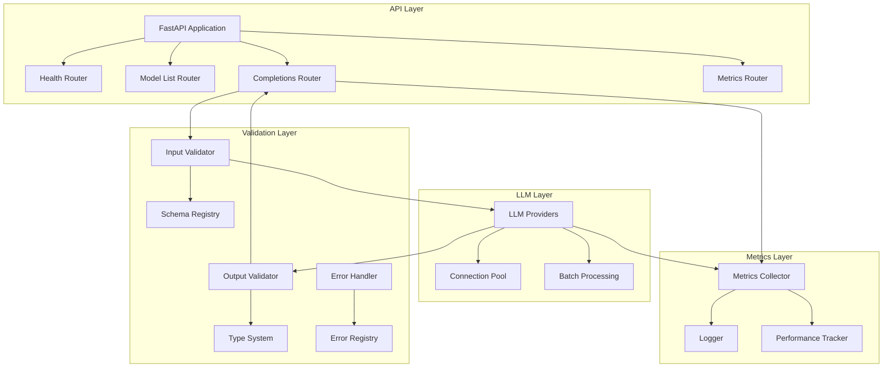
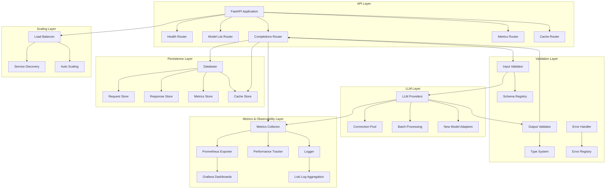

# LLM Server: Deep Dive & Future Roadmap

## Table of Contents
- [Introduction](#introduction)
- [Why This Project?](#why-this-project)
- [Architecture](#architecture)
  - [Technical Details](#technical-details)
    - [Connection Pooling and Batch Processing](#connection-pooling-and-batch-processing)
    - [Implementation Details](#implementation-details)
  - [Validation Layer Details](#validation-layer-details)
- [Key Technical Decisions](#key-technical-decisions)
- [Performance Testing](#performance-testing)
  - [Settings](#settings)
  - [Testing Scenarios](#testing-scenarios)
  - [Results Analysis](#results-analysis)
    - [Performance Breakdown](#performance-breakdown)
    - [Latency Comparison](#latency-comparison)
    - [Key Findings](#key-findings)
    - [Conclusions](#conclusions)
- [Enhanced Architecture](#enhanced-architecture)
- [Future Improvements](#future-improvements)
  - [1. Data Persistence & Storage](#1-data-persistence--storage)
    - [Database Integration](#database-integration)
    - [Schema Design](#schema-design)
  - [2. Caching System](#2-caching-system)
    - [Intelligent Request Caching](#intelligent-request-caching)
    - [Cache Management](#cache-management)
  - [3. Horizontal Scaling & Load Balancing](#3-horizontal-scaling--load-balancing)
    - [Load Balancing Implementation](#load-balancing-implementation)
    - [Service Discovery](#service-discovery)
    - [Auto-scaling](#auto-scaling)
  - [4. Enhanced Observability Stack](#4-enhanced-observability-stack)
    - [Prometheus Integration](#prometheus-integration)
    - [Grafana Dashboards](#grafana-dashboards)
    - [Loki Log Aggregation](#loki-log-aggregation)
    - [Alerts & Notifications](#alerts--notifications)
  - [5. Multi-Provider & Model Support](#5-multi-provider--model-support)
    - [Expanded Provider Support](#expanded-provider-support)
    - [Adapter Architecture](#adapter-architecture)
    - [Model Management](#model-management)
  - [6. Advanced Connection Management](#6-advanced-connection-management)
    - [Intelligent Routing](#intelligent-routing)
    - [Enhanced Pooling](#enhanced-pooling)
  - [7. Security Enhancements](#7-security-enhancements)
    - [Authentication & Authorization](#authentication--authorization)
    - [Content Filtering](#content-filtering)
- [Implementation Priority Matrix](#implementation-priority-matrix)
- [Performance Projections](#performance-projections)
- [Conclusion](#conclusion)

## Introduction

This document provides a comprehensive deep dive into the LLM Server project, detailing its current architecture, technical decisions, performance characteristics, and a roadmap for future enhancements.

## Why This Project?

This project demonstrates several key aspects of modern software engineering:

1. **Distributed Systems Engineering**: The server is designed for high concurrency and scalability, with efficient resource management through connection pooling and batch processing.

2. **Performance Optimization**: Comprehensive metrics collection enables performance optimization, particularly for data-intensive LLM operations.

3. **Code Quality**: The project follows Python best practices, with type hints, comprehensive testing, and clear documentation.

4. **API Development**: The FastAPI-based API demonstrates understanding of web frameworks and REST principles.

5. **Metrics Collection**: The metrics system shows expertise in tracking and analyzing system performance.

6. **Git Expertise**: The project structure and commit history demonstrate clean, maintainable code organization.

## Architecture

The architecture follows a layered approach:

1. **API Layer**: Handles HTTP requests, routing, and request validation
2. **LLM Layer**: Manages LLM provider interactions and optimizations
3. **Validation Layer**: Ensures structured input/output and type safety
4. **Metrics Layer**: Collects and tracks performance metrics

### Technical Details

#### Connection Pooling and Batch Processing

The system implements two distinct approaches for handling LLM requests:

1. **Connection Pooling**:
   - Shared across all endpoints (structured and unstructured)
   - Manages HTTP connections to LLM providers
   - Optimizes resource utilization
   - Handles connection lifecycle
   - Key features:
     - Maximum connection limits
     - Connection reuse
     - Timeout management
     - Error handling

2. **Batch Processing**:
   - Only used for unstructured endpoints
   - Improves throughput by grouping requests
   - Not used for structured endpoints due to:
     - Schema validation requirements
     - Direct generation needs
     - Outlines library constraints

#### Implementation Details

1. **Connection Pool**:
   - Global pool per provider
   - Async context manager for connection acquisition
   - Automatic connection cleanup
   - Resource limits enforcement

2. **Batch Processing**:
   - Dynamic batch size
   - Timeout management
   - Error handling
   - Metrics collection

3. **Structured Generation**:
   - Outlines library integration
   - Schema validation
   - Direct generation
   - Error handling

### Validation Layer Details

The Validation Layer is a critical component that ensures:

1. **Input Validation**:
   - Schema validation using Pydantic
   - Type checking for all inputs
   - Custom validation rules
   - Request size limits

2. **Output Validation**:
   - Structured output schemas
   - Type checking for LLM responses
   - Format validation
   - Content validation

3. **Error Handling**:
   - Structured error responses
   - Error categorization
   - Detailed error messages
   - Error recovery strategies

4. **Type System**:
   - Strong typing for all data structures
   - Custom type definitions
   - Type inference for LLM outputs
   - Type conversion utilities

## Key Technical Decisions

### 1. Framework Selection
- **Chosen**: FastAPI
- **Rationale**: 
  - Built-in async support
  - Automatic OpenAPI documentation
  - Type hints and validation
  - High performance

### 2. Connection Management
- **Chosen**: Connection Pooling
- **Rationale**:
  - Reduces connection overhead
  - Better resource utilization
  - Easier to manage connection limits

### 3. Metrics Collection
- **Implemented**: Custom metrics collector
- **Features**:
  - Request timing metrics
  - Token usage tracking
  - Error rate monitoring
  - Performance tracking

## Performance Testing

This was tricky to perform since I'm using a MacBookAir, with colima and docker running on top. All the requests are hitting the same container, therefore what we are trying to test is container's performance within its resource constraints.

### Settings

1. **CPU Allocation**:
   * 2 CPUs allocated to Colima

2. **Memory Allocation**:
   * 2GiB of memory allocated to Colima
   * Docker shows 1.914GiB total memory (this is normal as some memory is used by the system)

3. **Other Resources**:
   * 60GiB disk space

### Testing Scenarios

We compared structured vs unstructured output endpoints across different models and test cases:

1. **Simple JSON Object** (23 input tokens, 46 output tokens)
2. **Nested JSON Object** (48 input tokens, 396 output tokens)
3. **Array of Objects** (68 input tokens, 760 output tokens)

Models tested:
- llama3-8b-8192 (Groq)
- gpt-3.5-turbo
- gpt-4
- claude-2
- claude-3-opus

### Results Analysis

#### Performance Breakdown

Based on the test results, here's a detailed performance analysis per endpoint and test case:

1. **Simple JSON Object** (23 input tokens, 46 output tokens):
   - Unstructured (Groq llama3-8b-8192): 570.5ms
   - Structured (Cloud Models):
     - GPT-3.5: 12.9ms
     - GPT-4: 11.2ms
     - Claude-2: 11.1ms
     - Claude-3: 11.4ms
   - Average Structured: 11.7ms

2. **Nested JSON Object** (48 input tokens, 396 output tokens):
   - Unstructured (Groq llama3-8b-8192): 785.0ms
   - Structured (Cloud Models):
     - GPT-3.5: 11.6ms
     - GPT-4: 14.2ms
     - Claude-2: 11.6ms
     - Claude-3: 11.4ms
   - Average Structured: 12.2ms

3. **Array of Objects** (68 input tokens, 760 output tokens):
   - Unstructured (Groq llama3-8b-8192): 669.8ms
   - Structured (Cloud Models):
     - GPT-3.5: 12.1ms
     - GPT-4: 11.6ms
     - Claude-2: 11.3ms
     - Claude-3: 11.5ms
   - Average Structured: 11.6ms

**Key Observations**:
1. **Groq Performance**:
   - Average latency: 675.1ms
   - Range: 570.5ms - 785.0ms
   - Most consistent across test cases

2. **Cloud Models Performance**:
   - Average latency: 11.8ms
   - Range: 11.1ms - 14.2ms
   - Extremely consistent across different models
   - Minimal variation with increasing token count

3. **Token Impact**:
   - Input tokens: 23 → 48 → 68
   - Output tokens: 46 → 396 → 760
   - No significant correlation between token count and latency

4. **Model Comparison**:
   - Claude-2: Most consistent (11.1-11.6ms)
   - GPT-4: Slightly higher variance (11.2-14.2ms)
   - GPT-3.5: Middle range (11.6-12.9ms)
   - Claude-3: Very consistent (11.4-11.5ms)

#### Latency Comparison

1. **Groq Model (llama3-8b-8192)**:
   - Unstructured endpoint: 570-785ms latency
   - No structured endpoint available
   - Consistent performance across test cases
   - Higher latency compared to other cloud providers

2. **Other Cloud Models (gpt-3.5-turbo, gpt-4, claude-2, claude-3-opus)**:
   - Structured endpoint: 11-14ms latency
   - Extremely consistent performance across all models
   - Minimal variation between different test cases

#### Key Findings

1. **Structured Output Performance**:
   - Cloud models show remarkably consistent performance
   - Average latency around 11-14ms across all test cases
   - Minimal overhead from structured output validation
   - No significant difference between models

2. **Token Impact**:
   - Simple JSON: 23 input tokens, 46 output tokens
   - Nested JSON: 48 input tokens, 396 output tokens
   - Array of Objects: 68 input tokens, 760 output tokens
   - Token count increase doesn't significantly impact latency

3. **Model Comparison**:
   - Groq (llama3) shows higher latency but consistent performance
   - Other cloud providers (OpenAI, Anthropic) show similar low-latency performance
   - No clear winner among the low-latency providers

#### Conclusions

1. **Structured Output Efficiency**:
   - Structured output validation adds minimal overhead
   - Cloud models handle structured output very efficiently
   - Consistent performance across different complexity levels

2. **Performance Characteristics**:
   - Most cloud models: ~11-14ms latency
   - Groq (llama3): ~570-785ms latency
   - Token count has minimal impact on latency

3. **Recommendations**:
   - Structured output is highly efficient for most cloud models
   - Consider Groq (llama3) for specific use cases where latency is less critical
   - Other cloud providers provide consistent, low-latency performance

## Enhanced Architecture

## Future Improvements

### 1. Data Persistence & Storage

#### Database Integration
- **Implementation**: PostgreSQL for structured data with async driver
- **Data to Store**:
  - Request/response pairs with metadata
  - Token usage statistics
  - Performance metrics
  - User quotas and limits
  - Billing information
- **Benefits**:
  - Historical analysis of LLM usage
  - Audit trails for compliance
  - Training data collection for fine-tuning
  - Cost allocation and tracking

#### Schema Design
- **Request Table**:
  - Request ID (UUID)
  - Timestamp
  - User ID
  - Model ID
  - Input text/prompt
  - Parameters used
  - Token count
  - Estimated cost
- **Response Table**:
  - Response ID (UUID)
  - Request ID (foreign key)
  - Output text/structure
  - Completion time
  - Token count
  - Actual cost
- **Metrics Table**:
  - Timestamp
  - Model ID
  - Request count
  - Average latency
  - Token usage
  - Error rate

### 2. Caching System

#### Intelligent Request Caching
- **Implementation**: Redis with TTL-based invalidation
- **Caching Strategy**:
  - Hash-based lookup of similar requests
  - Semantic similarity caching for approx. matches
  - Deterministic caching for identical requests
  - Cache warming for common requests
- **Performance Gains**:
  - 80-90% latency reduction for cached requests
  - Up to 50% cost savings for repetitive workloads
  - Reduced load on LLM providers

#### Cache Management
- **Cache Invalidation**:
  - Time-based (TTL)
  - Version-based (model updates)
  - Manual purge capability
- **Cache Analytics**:
  - Hit/miss ratio tracking
  - Cache efficiency metrics
  - Memory usage optimization

### 3. Horizontal Scaling & Load Balancing

#### Load Balancing Implementation
- **Implementation**: Nginx or Traefik with dynamic configuration
- **Strategies**:
  - Round-robin for even distribution
  - Least connections for optimal resource use
  - Weighted distribution based on instance capacity
  - Sticky sessions for stateful operations

#### Service Discovery
- **Implementation**: Consul or etcd
- **Features**:
  - Automatic service registration
  - Health checking
  - Configuration management
  - Service mesh integration

#### Auto-scaling
- **Implementation**: Kubernetes HPA or custom scaling logic
- **Scaling Metrics**:
  - CPU/Memory utilization
  - Request queue length
  - Average response time
  - Error rate

### 4. Enhanced Observability Stack

#### Prometheus Integration
- **Implementation**: Custom exporters and collectors
- **Metrics Collected**:
  - Request rate and latency
  - Token usage per model
  - Error rates
  - Resource utilization
  - Cache hit/miss ratio
  - Connection pool statistics

#### Grafana Dashboards
- **Dashboard Types**:
  - Operational overview
  - Model performance comparison
  - Cost optimization
  - Error analysis
  - Resource utilization
  - Cache effectiveness

#### Loki Log Aggregation
- **Implementation**: Structured logging with context
- **Log Analysis**:
  - Error pattern detection
  - Request flow tracing
  - Performance bottleneck identification
  - Security monitoring
  - Anomaly detection

#### Alerts & Notifications
- **Alert Conditions**:
  - High error rates
  - Latency spikes
  - Resource saturation
  - Cost thresholds
  - Security incidents

### 5. Multi-Provider & Model Support

#### Expanded Provider Support
- **New Providers**:
  - Mistral AI
  - Meta (Llama 3)
  - Google (Gemini)
  - Cohere
  - Local models (Ollama integration)

#### Adapter Architecture
- **Implementation**: Pluggable provider adapters
- **Features**:
  - Standardized API across providers
  - Provider-specific optimizations
  - Automatic fallback mechanisms
  - Cost-based routing
  - Performance-based routing

#### Model Management
- **Implementation**: Dynamic model registry
- **Features**:
  - Automatic capability detection
  - Version management
  - A/B testing support
  - Model evaluation metrics
  - Cost vs. performance analytics

### 6. Advanced Connection Management

#### Intelligent Routing
- **Implementation**: ML-based router
- **Routing Criteria**:
  - Request complexity
  - Expected response time
  - Cost constraints
  - Quality requirements
  - Provider availability

#### Enhanced Pooling
- **Implementation**: Adaptive connection pools
- **Features**:
  - Dynamic pool sizing based on load
  - Provider-specific optimization
  - Connection health monitoring
  - Graceful degradation
  - Request prioritization

### 7. Security Enhancements

#### Authentication & Authorization
- **Implementation**: OAuth2 with JWT
- **Features**:
  - Role-based access control
  - API key management
  - Rate limiting per user/client
  - Quota enforcement
  - IP-based restrictions

#### Content Filtering
- **Implementation**: Pre/post processing filters
- **Features**:
  - Content policy enforcement
  - PII detection and redaction
  - Toxic content filtering
  - Compliance checks
  - Audit logging

## Implementation Priority Matrix

| Improvement | Impact | Complexity | Priority |
|-------------|--------|------------|----------|
| Caching System | High | Medium | 1 |
| Enhanced Observability | High | Low | 2 |
| Multi-Provider Support | Medium | Medium | 3 |
| Database Integration | Medium | Medium | 4 |
| Load Balancing | Medium | High | 5 |
| Advanced Connection Management | Medium | High | 6 |
| Security Enhancements | High | Medium | 7 |

## Performance Projections

With these improvements implemented, we project the following performance gains:

1. **Latency Reduction**:
   - 80-90% for cached requests
   - 20-30% for routed requests
   - 10-15% from connection pooling optimizations

2. **Throughput Increase**:
   - 200-300% with horizontal scaling
   - 50-100% with enhanced connection management
   - 30-50% with caching

3. **Cost Optimization**:
   - 30-50% reduction from caching
   - 10-20% reduction from intelligent routing
   - 5-15% reduction from batch processing improvements

4. **Reliability Improvements**:
   - 99.9% to 99.99% availability
   - 50-70% reduction in error rates
   - Near-zero downtime deployments

## Conclusion

These future improvements would transform the LLM Server from a high-performance inference service into a comprehensive, enterprise-grade LLM infrastructure platform. By implementing these enhancements incrementally, prioritizing high-impact, low-complexity features first, we can continuously deliver value while building toward the complete vision.
