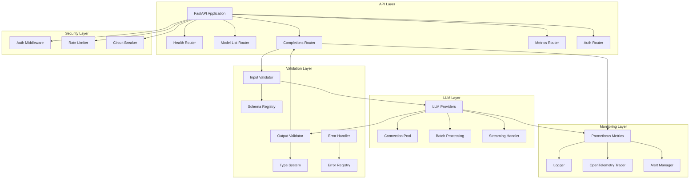

# Deep Dive

## Why this project?

This project demonstrates several key aspects of modern software engineering:

1. **Distributed Systems Engineering**: The server is designed for high concurrency and scalability, with efficient resource management through connection pooling and batch processing.

2. **Performance Optimization**: Comprehensive metrics collection and monitoring enable performance optimization, particularly for data-intensive LLM operations.

3. **Code Quality**: The project follows Python best practices, with type hints, comprehensive testing, and clear documentation.

4. **API Development**: The FastAPI-based API demonstrates understanding of web frameworks and REST principles.

5. **Monitoring and Observability**: The comprehensive metrics system shows expertise in system monitoring and debugging.

6. **Git Expertise**: The project structure and commit history demonstrate clean, maintainable code organization.

## Architecture

The architecture follows a layered approach:

1. **API Layer**: Handles HTTP requests, routing, and request validation
2. **LLM Layer**: Manages LLM provider interactions and optimizations
3. **Validation Layer**: Ensures structured input/output and type safety
4. **Monitoring Layer**: Collects metrics and provides observability
5. **Security Layer**: Implements security measures and rate limiting

### Validation Layer Details

The Validation Layer is a critical component that ensures:

1. **Input Validation**:
   - Schema validation using Pydantic
   - Type checking for all inputs
   - Custom validation rules
   - Request size limits

2. **Output Validation**:
   - Structured output schemas
   - Type checking for LLM responses
   - Format validation
   - Content validation

3. **Error Handling**:
   - Structured error responses
   - Error categorization
   - Detailed error messages
   - Error recovery strategies

4. **Type System**:
   - Strong typing for all data structures
   - Custom type definitions
   - Type inference for LLM outputs
   - Type conversion utilities

## Key Technical Decisions and Alternatives

### 1. Framework Selection
- **Chosen**: FastAPI
- **Alternatives Considered**: Flask, Django, aiohttp
- **Rationale**: 
  - Built-in async support
  - Automatic OpenAPI documentation
  - Type hints and validation
  - High performance

### 2. Connection Management
- **Chosen**: Connection Pooling
- **Alternatives Considered**: Direct connections, connection multiplexing
- **Rationale**:
  - Reduces connection overhead
  - Better resource utilization
  - Easier to manage connection limits

### 3. Monitoring Solution
- **Chosen**: Prometheus + OpenTelemetry
- **Alternatives Considered**: StatsD, Datadog
- **Rationale**:
  - Open-source and widely adopted
  - Good integration with Kubernetes
  - Flexible metric collection

### 4. Message Queue
- **Chosen**: Redis
- **Alternatives Considered**: RabbitMQ, Kafka
- **Rationale**:
  - Simpler setup and maintenance
  - Good performance for our scale
  - Built-in persistence

## Performance Testing

This was tricky to perform since I'm using a MacBookAir, with colima and docker running on top. All the requests are hitting the same container, therefore what we are trying to test is container's performance within its resource constraints.

### Settings

1. CPU Allocation:
   * 2 CPUs allocated to Colima

2. Memory Allocation:
   * 2GiB of memory allocated to Colima
   * Docker shows 1.914GiB total memory (this is normal as some memory is used by the system)

3. Other Resources:
   * 60GiB disk space

Conclusions:
* Since we have 2 CPUs, using 2 threads in wrk makes sense
* With 2GiB of memory, we should be conservative with concurrent connections -> Each connection consumes some memory for buffers and state
* The 60GiB disk space suggests we can run longer tests without worrying about disk space

### Testing Scenarios

[Testing scenarios to be added]

### Results Analysis

[Results analysis to be added]

## Scaling Considerations

This is a deep dive into the LLM Server project. The goal of the project is to serve foundation models with structured output in an efficient way for high throughputs.

### Horizontal Scaling
- **Load Balancing**: Implement round-robin or least-connections strategy
- **Service Discovery**: Use Kubernetes service discovery or Consul
- **State Management**: Keep state in Redis or database
- **Health Checks**: Implement proper health check endpoints

### Vertical Scaling
- **Resource Optimization**: 
  - Memory management for LLM operations
  - CPU affinity for better performance
  - Connection pool sizing
- **Batch Processing**: 
  - Optimal batch sizes
  - Dynamic batching based on load

### Performance Optimization
- **Caching Strategy**:
  - Response caching for similar requests
  - Model output caching
  - Token usage caching
- **Connection Management**:
  - Adaptive connection pooling
  - Circuit breakers for external services
  - Retry strategies with backoff

### Monitoring and Alerting
- **Metrics Collection**:
  - Request latency
  - Error rates
  - Resource utilization
  - Token usage and costs
- **Alerting Rules**:
  - Error rate thresholds
  - Latency thresholds
  - Resource usage thresholds

### Security Considerations
- **Rate Limiting**: 
  - Per-user rate limits
  - Global rate limits
  - Dynamic rate limiting based on load
- **Authentication**:
  - JWT-based authentication
  - API key management
  - Role-based access control

### Future Improvements
1. **Multi-region Deployment**:
   - Geographic distribution
   - Regional failover
   - Data locality optimization

2. **Advanced Caching**:
   - Distributed caching
   - Cache invalidation strategies
   - Cache warming

3. **Enhanced Monitoring**:
   - Custom dashboards
   - Anomaly detection
   - Predictive scaling

4. **Resource Optimization**:
   - Dynamic resource allocation
   - Auto-scaling based on metrics
   - Cost optimization strategies 