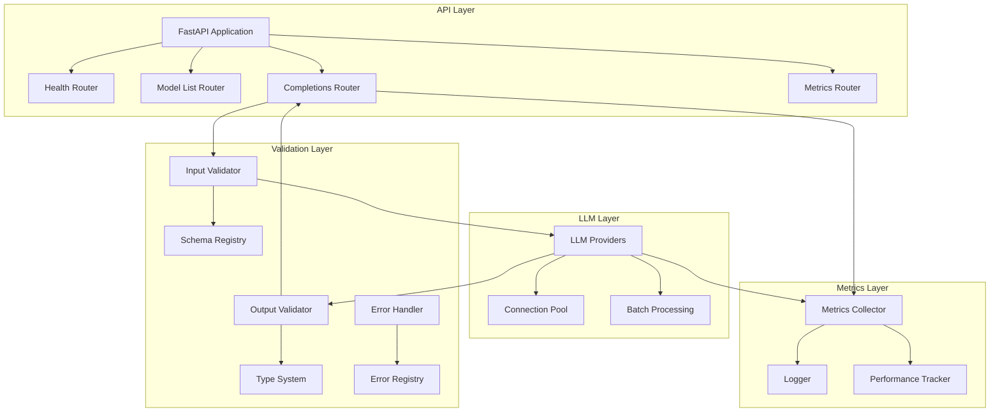

# Deep Dive

## Why this project?

This project demonstrates several key aspects of modern software engineering:

1. **Distributed Systems Engineering**: The server is designed for high concurrency and scalability, with efficient resource management through connection pooling and batch processing.

2. **Performance Optimization**: Comprehensive metrics collection enables performance optimization, particularly for data-intensive LLM operations.

3. **Code Quality**: The project follows Python best practices, with type hints, comprehensive testing, and clear documentation.

4. **API Development**: The FastAPI-based API demonstrates understanding of web frameworks and REST principles.

5. **Metrics Collection**: The metrics system shows expertise in tracking and analyzing system performance.

6. **Git Expertise**: The project structure and commit history demonstrate clean, maintainable code organization.

## Architecture

The architecture follows a layered approach:

1. **API Layer**: Handles HTTP requests, routing, and request validation
2. **LLM Layer**: Manages LLM provider interactions and optimizations
3. **Validation Layer**: Ensures structured input/output and type safety
4. **Metrics Layer**: Collects and tracks performance metrics

### Validation Layer Details

The Validation Layer is a critical component that ensures:

1. **Input Validation**:
   - Schema validation using Pydantic
   - Type checking for all inputs
   - Custom validation rules
   - Request size limits

2. **Output Validation**:
   - Structured output schemas
   - Type checking for LLM responses
   - Format validation
   - Content validation

3. **Error Handling**:
   - Structured error responses
   - Error categorization
   - Detailed error messages
   - Error recovery strategies

4. **Type System**:
   - Strong typing for all data structures
   - Custom type definitions
   - Type inference for LLM outputs
   - Type conversion utilities

## Key Technical Decisions

### 1. Framework Selection
- **Chosen**: FastAPI
- **Rationale**: 
  - Built-in async support
  - Automatic OpenAPI documentation
  - Type hints and validation
  - High performance

### 2. Connection Management
- **Chosen**: Connection Pooling
- **Rationale**:
  - Reduces connection overhead
  - Better resource utilization
  - Easier to manage connection limits

### 3. Metrics Collection
- **Implemented**: Custom metrics collector
- **Features**:
  - Request timing metrics
  - Token usage tracking
  - Error rate monitoring
  - Performance tracking

## Performance Testing

This was tricky to perform since I'm using a MacBookAir, with colima and docker running on top. All the requests are hitting the same container, therefore what we are trying to test is container's performance within its resource constraints.

### Settings

1. CPU Allocation:
   * 2 CPUs allocated to Colima

2. Memory Allocation:
   * 2GiB of memory allocated to Colima
   * Docker shows 1.914GiB total memory (this is normal as some memory is used by the system)

3. Other Resources:
   * 60GiB disk space

Conclusions:
* Since we have 2 CPUs, using 2 threads in wrk makes sense
* With 2GiB of memory, we should be conservative with concurrent connections -> Each connection consumes some memory for buffers and state
* The 60GiB disk space suggests we can run longer tests without worrying about disk space

### Testing Scenarios

[Testing scenarios to be added]

### Results Analysis

[Results analysis to be added]

## Scaling Considerations

This is a deep dive into the LLM Server project. The goal of the project is to serve foundation models with structured output in an efficient way for high throughputs.

### Current Implementation
- **Connection Pooling**: Efficient resource management
- **Batch Processing**: Improved throughput
- **Metrics Collection**: Performance tracking
- **Error Handling**: Robust error management

### Future Improvements
1. **Horizontal Scaling**:
   - Load balancing implementation
   - Service discovery
   - State management

2. **Enhanced Metrics**:
   - More detailed performance metrics
   - Cost tracking
   - Resource utilization metrics

3. **Resource Optimization**:
   - Dynamic resource allocation
   - Connection pool optimization
   - Memory management improvements 